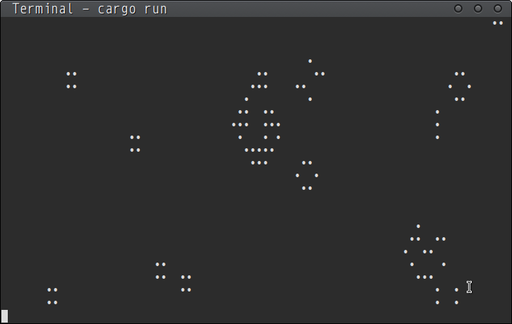

[](https://crates.io/crates/conway-rs)
[](LICENSE)

# Description
Another ~stupid~ implementation of Conways's Game of Life written in Rust language.



# Motivation
Use a more complex example than 'hello world' to learn a new language.

# Usage

Shortly:

```shell
git clone https://github.com/ryukinix/conway-rs.git
cd conway-rs
cargo build --release
cargo run
```

Via crates.io:

``` shell
cargo install conway-rs && ~/.cargo/bin/conway
```

You need the Rust environment to build this repository. Specifically the Rust Compiler `rustc` and the Rust package manager `cargo`. You can download both on the official website of the [Rust language](https://www.rust-lang.org/en-US/) or in the official repositories of your operating system.


# Author
* [Manoel Vilela](https://www.github.com/ryukinix)

# License
[MIT](LICENSE)
